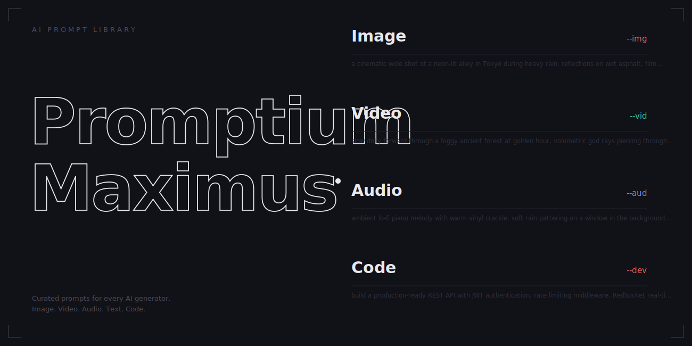
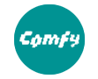

<p align="center">
  
</p>

<p align="center">
  
  
  
  
</p>

---

## What's Inside

This is not a collection of untested prompts scraped from the internet. Every technique, snippet, and workflow in this repo has been **verified in real production** — ad campaigns, social content, brand videos. When something doesn't work, it's documented in the failures/fixes section so you don't waste credits finding out.

### Coverage

| Category | Folder | Files | What you get |
|----------|--------|------:|-------------|
| **Seedance 2.0** | `01-SEEDANCE/` | 41 | Complete prompt engineering guide, 500+ prompt library, community research, gap analysis, style anchors, gold examples, camera dictionary, failure fixes |
| **Video AI** | `02-VIDEO/` | 25 | Kling 3.0, LTX-2, model comparisons, UGC effect guide, skin realism guide, CapCut tutorials, production pipeline |
| **Image AI** | `03-IMMAGINI/` | 8 | Nano Banana 2.0, FaceForge character sheets, ComfyUI MCP server, 2D rigging tools |
| **Audio** | `04-AUDIO/` | 1 | ElevenLabs narration scripts |
| **Remotion** | `05-REMOTION/` | 51 | Programmatic video with React — 37 best-practice rules, prompt libraries, project guides |
| **Scripts** | `06-SCRIPTS/` | 10 | Python utilities — grid maker, face crop, creative overlays, X/Twitter search |

---

## Quick Start — Find What You Need

### By AI Model

| Model | Type | Start here |
|-------|------|-----------|
| Seedance 2.0 | Video | [`01-SEEDANCE/guide/`](01-SEEDANCE/guide/) — full prompt engineering guide |
| Kling 3.0 | Video | [`02-VIDEO/kling/`](02-VIDEO/kling/) — prompt guide + UGC workflow |
| LTX-2 | Video | [`02-VIDEO/ltx-cineclaw/`](02-VIDEO/ltx-cineclaw/) — text/image/audio-to-video |
| Nano Banana 2.0 | Image | [`03-IMMAGINI/nano-banana/`](03-IMMAGINI/nano-banana/) — face swap, anti-block, skin |
| Midjourney | Image | [`03-IMMAGINI/faceforge-generatori/`](03-IMMAGINI/faceforge-generatori/) — character sheets |
| DALL-E / ChatGPT | Image | [`03-IMMAGINI/faceforge-generatori/`](03-IMMAGINI/faceforge-generatori/) — character sheets |
| Flux / SD | Image | [`03-IMMAGINI/faceforge-generatori/`](03-IMMAGINI/faceforge-generatori/) + [`comfyui/`](03-IMMAGINI/comfyui/) |
| ComfyUI | Backend | [`03-IMMAGINI/comfyui/`](03-IMMAGINI/comfyui/) — MCP server setup |
| ElevenLabs | Audio | [`04-AUDIO/`](04-AUDIO/) |
| Remotion | Programmatic | [`05-REMOTION/`](05-REMOTION/) — 37 rules + prompt libraries |
| CapCut | Editing | [`02-VIDEO/capcut/`](02-VIDEO/capcut/) — 12 tutorial files |

### By Technique

| Technique | File | What it solves |
|-----------|------|---------------|
| **UGC Effect** | [`02-VIDEO/tecniche/UGC-STYLE-GUIDE.md`](02-VIDEO/tecniche/UGC-STYLE-GUIDE.md) | Make AI video look like real phone footage |
| **Skin Realism** | [`02-VIDEO/tecniche/SKIN-PELLE-PULITA-GUIDE.md`](02-VIDEO/tecniche/SKIN-PELLE-PULITA-GUIDE.md) | Fix AI's plastic/smooth skin problem |
| **Face Bypass** | [`01-SEEDANCE/references/faceforge-guide.md`](01-SEEDANCE/references/faceforge-guide.md) | Get faces past Seedance content filter |
| **Character Sheets** | [`03-IMMAGINI/nano-banana/NANO-BANANA-GUIDE.md`](03-IMMAGINI/nano-banana/NANO-BANANA-GUIDE.md) | Consistent character across generations |
| **Anti-Block** | [`03-IMMAGINI/nano-banana/`](03-IMMAGINI/nano-banana/) | Bypass content filter word blocks |
| **Face Swap** | [`03-IMMAGINI/nano-banana/NANO-BANANA-GUIDE.md`](03-IMMAGINI/nano-banana/NANO-BANANA-GUIDE.md) | Seamless blend (not "swap/replace") |
| **Production Pipeline** | [`02-VIDEO/HANDOFF_PROMPTS_PIPELINE.md`](02-VIDEO/HANDOFF_PROMPTS_PIPELINE.md) | End-to-end: image -> video -> audio -> edit |

---

## Highlights

### Seedance 2.0 — The Deepest Coverage You'll Find

- **500+ prompt library** with categorized templates and variations
- **106 curated prompts** from [YouMind-OpenLab/awesome-seedance-2-prompts](https://github.com/YouMind-OpenLab/awesome-seedance-2-prompts) (EN/IT/ZH) + 1000 video URLs
- Community research from Reddit, X/Twitter, YouTube, GitHub, Chinese platforms
- Gap analysis with A/B test results, failure patterns, advanced vocabulary
- Complete reference library: camera movements, color/lighting, style anchors, audio engineering

### Battle-Tested Techniques

**UGC Effect** — The #1 problem: AI video looks too clean. This guide covers:
- Kling's forbidden words (never write "phone" or "camera" — it renders them in frame)
- Selfie effect without generating a phone in hand
- Camera imperfection keywords that sell realism
- Copy-paste snippets ready for any prompt

**Skin Realism** — AI generates plastic skin by default. Four snippet levels from "bathroom mirror selfie" to "beautiful but imperfect" for beauty ads, with per-model keywords.

**FaceForge** — Character sheet generation that produces *photos*, not game art. The trick: "casting agency photos" + "Canon EOS R5" instead of "character reference sheet" + "white background".

### Production Pipeline

[`HANDOFF_PROMPTS_PIPELINE.md`](02-VIDEO/HANDOFF_PROMPTS_PIPELINE.md) is the master document — a complete end-to-end pipeline:

```
Nano Banana (image) -> Grid overlay -> Seedance/Kling (video) -> ElevenLabs (voice) -> Premiere (edit)
```

Every prompt tested. Every failure documented. Every workaround proven.

---

## Repo Structure

```
PromptiusMaximus/
├── 01-SEEDANCE/          # Seedance 2.0 — guides, prompts, research, references
│   ├── guide/            # 6 comprehensive prompt engineering guides
│   ├── prompts/          # 6 prompt libraries (500+ prompts)
│   ├── research/         # 10 community research files
│   ├── gap-analysis/     # 5 vocabulary & failure analysis files
│   ├── references/       # 8 reference materials (camera, color, style, fixes)
│   ├── skill/            # Skill implementation
│   └── awesome-seedance-repo/  # YouMind curated collection (EN/IT/ZH)
├── 02-VIDEO/             # Video AI models + techniques
│   ├── kling/            # Kling 3.0 prompt guide
│   ├── ltx-cineclaw/     # LTX-2 (Lightricks)
│   ├── ltx-integration/  # LTX-2 Python integration
│   ├── tecniche/         # UGC + Skin realism guides
│   ├── capcut/           # CapCut tutorials (ITA + EN)
│   ├── foxelli/          # Production prompts
│   └── confronti-modelli/# Model comparison (Feb 2026)
├── 03-IMMAGINI/          # Image AI models
│   ├── nano-banana/      # Nano Banana 2.0 complete guide
│   ├── faceforge-generatori/  # Character sheets (MJ, DALL-E, Flux, Dreamina)
│   ├── comfyui/          # ComfyUI MCP server
│   └── character-tools/  # 2D rigging tools
├── 04-AUDIO/             # ElevenLabs scripts
├── 05-REMOTION/          # Programmatic video (React)
│   ├── best-practices/   # 37 rule files + 3 code examples
│   ├── xcite-guida/      # X-Cite Ventures project
│   ├── xcite-prompts/    # Remotion prompt libraries
│   ├── guide/            # Complete Remotion guide (ITA)
│   └── ardoino/          # News overlay project
├── 06-SCRIPTS/           # Python utilities
├── assets/               # Logo + AI tool icons
└── _INDICE.md            # Complete index with model/technique maps
```

---

## Supported Models

<table>
<tr>
<td align="center"><br/><sub>Seedance 2.0</sub></td>
<td align="center"><br/><sub>Kling 3.0</sub></td>
<td align="center"><br/><sub>ComfyUI</sub></td>
<td align="center"><br/><sub>Runway</sub></td>
<td align="center"><br/><sub>Claude</sub></td>
<td align="center"><br/><sub>After Effects</sub></td>
</tr>
</table>

Plus: **LTX-2** / **Nano Banana** / **Midjourney** / **DALL-E** / **Flux** / **Dreamina** / **ElevenLabs** / **Remotion** / **CapCut** / **Sora** / **Veo** / **Wan** / **Higgsfield**

---

## How to Use

1. **Clone the repo**
   ```bash
   git clone https://github.com/babakarto/PromptiusMaximus.git
   ```

2. **Find your model** — use the [Quick Start tables](#quick-start--find-what-you-need) above

3. **Copy-paste snippets** — most guides include ready-to-use prompt blocks in code fences

4. **Check the pipeline** — [`HANDOFF_PROMPTS_PIPELINE.md`](02-VIDEO/HANDOFF_PROMPTS_PIPELINE.md) for end-to-end production workflow

5. **Run scripts** (optional)
   ```bash
   cd 06-SCRIPTS
   pip install -r requirements.txt
   python grid_maker.py
   ```

---

## Contributing

This is a living collection. If you have tested prompts, techniques, or model-specific tips:

1. Fork the repo
2. Add your content in the appropriate category folder
3. Update `_INDICE.md` with a one-line entry
4. Open a PR with a description of what was tested and on which model

Quality bar: **only tested, verified content**. No untested prompt dumps.

---

## License

This collection is for educational and creative production purposes. Individual prompt techniques and research are attributed to their original sources where known. AI tool logos belong to their respective companies.

---

<p align="center">
  <sub>Built with real production experience, not vibes.</sub>
</p>
